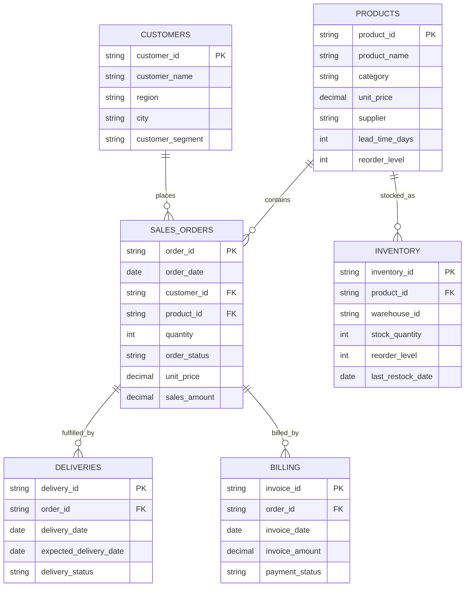

# RUSA Entity Relationship Diagram

```mermaid
erDiagram
    CUSTOMERS ||--o{ SALES_ORDERS : places
    PRODUCTS ||--o{ SALES_ORDERS : contains
    PRODUCTS ||--o{ INVENTORY : stocked_as
    SALES_ORDERS ||--o{ DELIVERIES : fulfilled_by
    SALES_ORDERS ||--o{ BILLING : billed_by

    CUSTOMERS {
      string customer_id PK
      string customer_name
      string region
      string city
      string customer_segment
    }
    PRODUCTS {
      string product_id PK
      string product_name
      string category
      decimal unit_price
      string supplier
      int lead_time_days
      int reorder_level
    }
    SALES_ORDERS {
      string order_id PK
      date order_date
      string customer_id FK
      string product_id FK
      int quantity
      string order_status
      decimal unit_price
      decimal sales_amount
    }
    INVENTORY {
      string inventory_id PK
      string product_id FK
      string warehouse_id
      int stock_quantity
      int reorder_level
      date last_restock_date
    }
    DELIVERIES {
      string delivery_id PK
      string order_id FK
      date delivery_date
      date expected_delivery_date
      string delivery_status
    }
    BILLING {
      string invoice_id PK
      string order_id FK
      date invoice_date
      decimal invoice_amount
      string payment_status
    }
```

The Gold layer is derived from these Silver entities and is not a separate transactional entity model.
